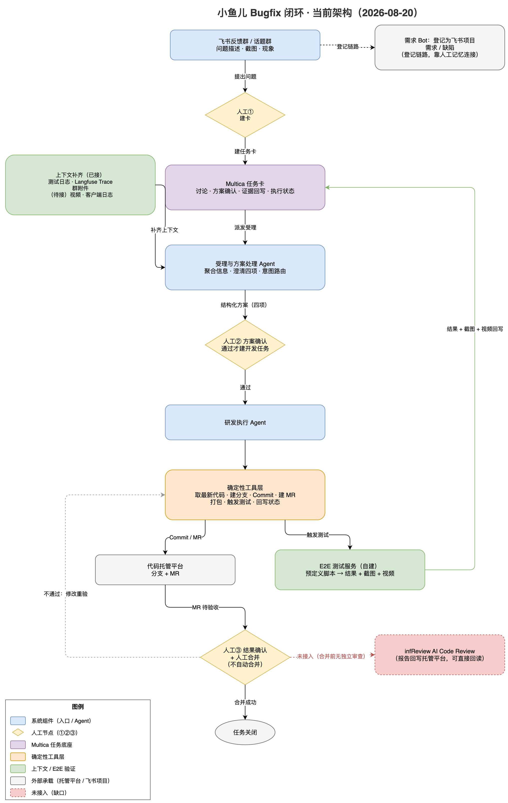
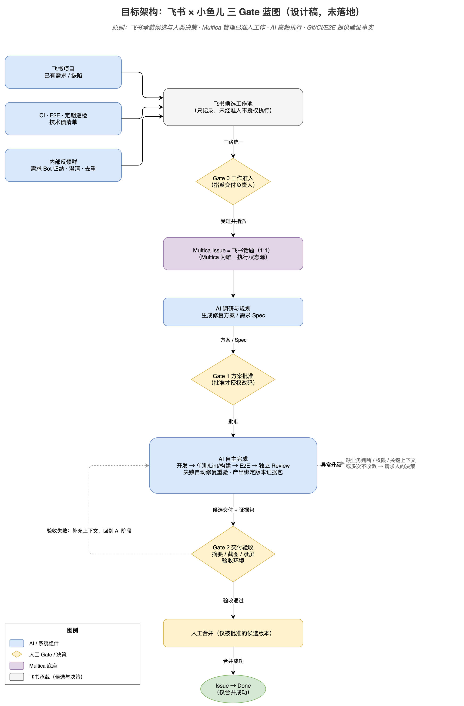

# 自动化软件生产：现状与技术架构（2026-08-20）

> 事实截至 2026-08-20，来源：四次访谈（V1/V2 小鱼儿两场、V3 需求研发线、V4 即 V1 补充）、全闭环构想（08-07）、三 Gate 蓝图、Multica 调研。详细论证见《汇总报告》《00-05 系列》，本文只留结论和架构。

## 1. 现状一句话

**小鱼儿 Bugfix 链路是全公司最接近闭环的实践**，已真实跑通：

> 受理澄清 → 方案审批（人工）→ AI 改码 → E2E 截图/视频留证 → 人工合并

解决率约 50%-60%（两个口径未对齐，需回听核对），目标 80%。但它只是构想 12 环节中的**执行段子集**：

- 只做 Bugfix；需求侧（采集 / 聚类 / 优先级 / Spec / 排期）整段缺失，发布侧（版本聚集 / 发布 / 回滚 / 沉淀）整段缺失
- **CodeReview 尚未接入小鱼儿**——勘误：此前《汇总报告》称"CR 结果已在消费"，不准确；实际是 infReview 侧在内部测试中，小鱼儿生产链路没有 CR 环节，AI 改的码合并前无独立审查
- 入口建卡仍人工触发；无外层编排，Agent 协作靠 Multica 任务卡自身能力兜底

其余各线一句话：**infReview**（CR 产品）能力可用、接入路径已明确（报告回写托管平台，直接回读即可，无需新 API），但还没接；**需求研发线**有教训（神州项目：自动开发效果完全取决于输入文档质量）有定位（DeepMap 做知识资产平台），无落地链路；**测试建设**刚起步（1 名实习生补 E2E 用例）；**常规研发流程**仍传统（评审→设计→开发，变化只有 CR 用了机器人、设计可出 HTML）。

## 2. 当前架构：小鱼儿 Bugfix 闭环

**读图要点：**

1. **三个人工点（①②③）是架构关键**。早期"用户给点信息 Agent 就直接干"，效果差；现在四项明确（要解决什么 / 是否该做 / 什么方案 / 怎么验收）+ 人工确认才放行。这是全链最重要的一道门。
2. **2 个 Agent**（原 3 个，受理与交互分析合并）：受理与方案处理（统一入口 + 意图路由）+ 研发执行；没有独立调度 Agent，调度 = 受理 Agent 路由 + Multica 派发。
3. **确定性工具封装**：建分支、Commit、建 MR、打包、触发测试、回写状态全部工具化，不让 Agent 自己探索命令行。原则：确定性步骤给工具，Agent 精力留给理解和决策。
4. **Multica 是实际底座**（任务卡承载全流程），但它没有审批门、没有跨任务编排、没有飞书集成——这三样都要自建，也就是当前的缺口。
5. 另有一条**登记链路**：需求 Bot 把问题登记为飞书项目的需求/缺陷，与执行链（Multica）之间**靠人工记忆连接**——蓝图要解决的第一个断裂就在这。

**短板按影响排序：** ① 合并前无独立审查（CR 未接入）② 报告噪声——AI 全量输出问题，人读不过来（团队自认最大现实问题，需聚合分级+摘要先行）③ 入口人工触发 + 两链断裂 ④ 无编排/Hook（多 Agent 交接的状态、通知、异常停机机制缺失）⑤ E2E 每次重装环境太慢（方向：基线镜像，未落地）。

## 3. 目标架构：三 Gate 蓝图（设计稿，未落地）

原则：**飞书承载候选与人类决策，Multica 管理已准入工作，AI 高频执行，Git/CI/E2E 提供验证事实。**

**与现状的关系**：Gate 1 的方案审批、Gate 2 的验收+人工合并在现有链路已在真实运行，蓝图是把它们形式化；净新增的是候选池三路来源、Issue=话题绑定、独立 Review、绑定版本的证据包、验收环境——全部待建（蓝图自身的排期项：CICD 巡检日报、Gate 0 后自动拉话题、方案后推卡片）。

**与构想的关系**（沿用 03 结论）："全自动 / 每日发布 / 无人值守"已否决，可行域 = Bugfix 型单交付闭环（人工门禁版）。当前方向正确，缺的是入口自动化、CR 接入、编排层和证据包，不是推倒重来。

## 4. 待确认（3 件）

1. 解决率 50%（V1）vs 60%（V4）口径对齐 + 回听核对数字；
2. CR 联调实测数据与正式接入时点；
3. 常规研发的"机器人 CR"是否即 infReview。
