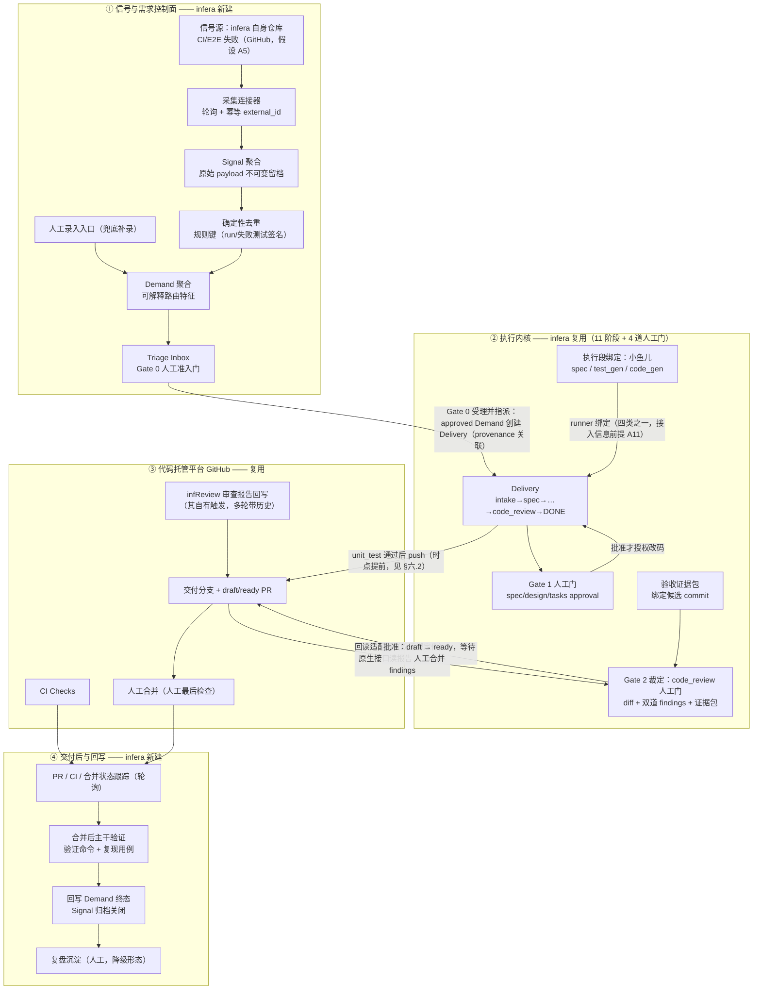
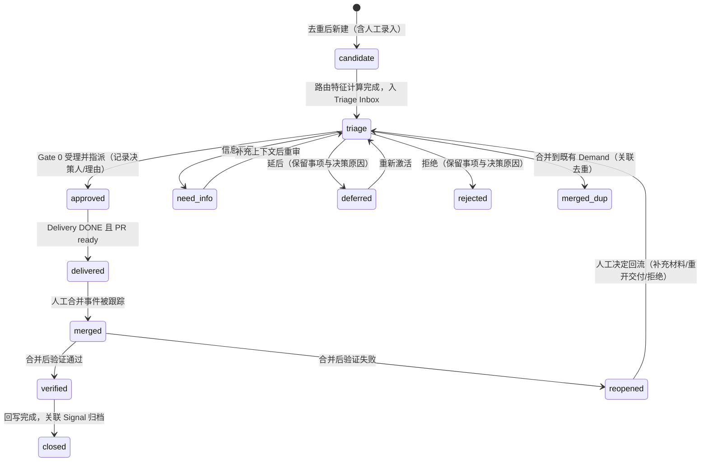
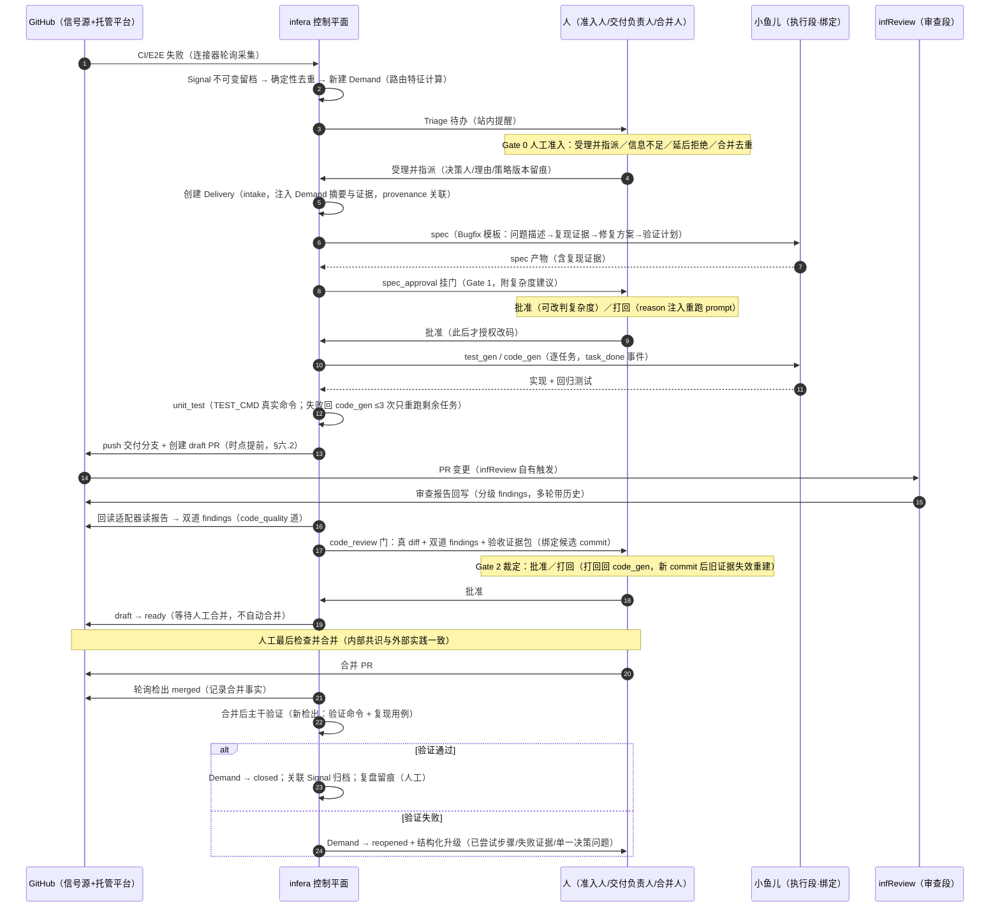
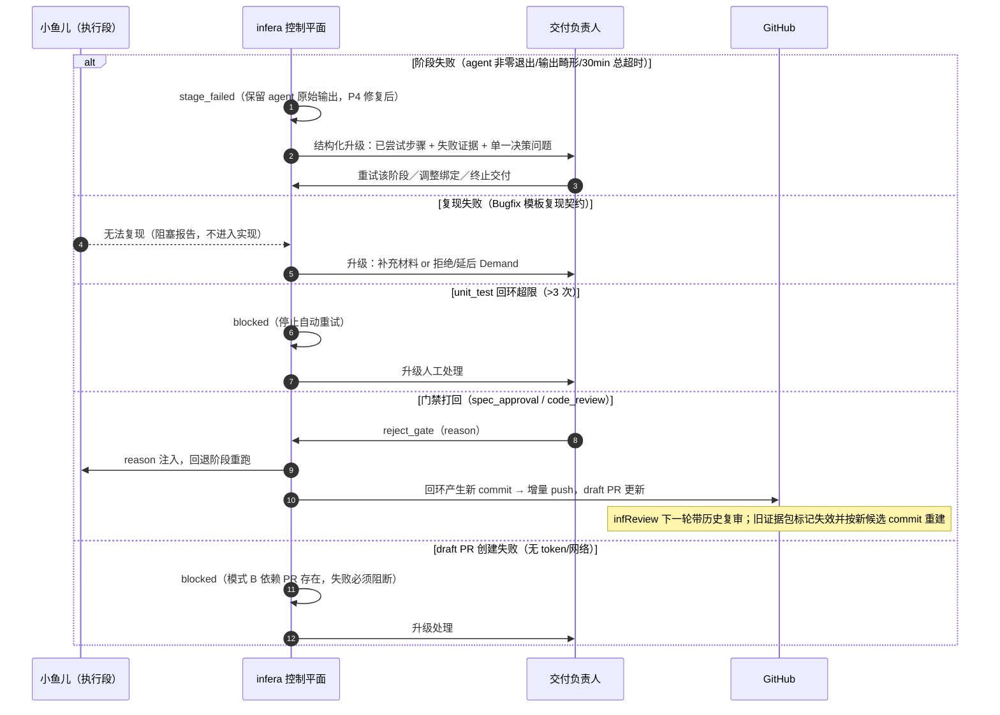

# 05 · MVP 架构设计（2026-08-20）

- 日期：2026-08-20
- 系列位置：自动化生产推进分析系列第 05 篇（设计篇）
- 事实基线：〔01〕`01-现状盘点-内部产品能力_2026-08-20.md`、〔02〕`02-现状盘点-infera平台_2026-08-20.md`；历史输入〔0818〕`docs/infera-全自动化软件生产闭环差距分析_2026-08-18.md`（其 §4 建模建议与 §6 纵向切片建议是本设计的形态输入，凡与 03 冲突处一律以 03 为准）。
- **契约服从声明**：本设计范围 = 〔03-§五.5.2〕划定的"子集甲全部 + 子集乙对应设计"；全部判定服从〔03〕（唯一结论源），不为子集丙环节产出实现设计；不推翻〔03-§四.1〕否决项与〔03-§四.5〕自建边界。若实现中发现设计与 03 冲突，按〔03-§七.3〕回报立串行修订任务，不在本文就地改写结论。
- 本文只做设计，不含实现代码；排期归 04。

---

## 一、设计范围、前提与架构假设

### 一.1 纵向切片定义（对齐 0818 §6，替换项服从 03）

MVP 目标是第一个可落地纵向切片。0818 §6 建议的切片原文为"GitHub Issue / 内部反馈 → Signal → 去重并形成 Demand → 人工 triage → 创建 Delivery → 真实质量门并开 PR → 人工合并 → 单一 staging 环境验证 → 结果回写 Demand"。本文对齐该骨架，按 03 结论做三处替换与收窄：

```text
内部信号（infera 自身仓库 CI/E2E 失败，D5-A）
  → Signal（不可变留档 + 确定性去重）
  → Demand（人工 triage，Gate 0 形态）
  → Delivery（infera 11 阶段执行内核；执行段绑小鱼儿、审查段接 infReview）
  → 质量门（4 道人工门 + 双道 findings + 验收证据包）
  → draft PR / ready PR（GitHub）
  → 人工合并（代码托管平台原生操作，不自动合并）
  → 合并后主干验证（替代 0818 的"staging 环境验证"）
  → 回写 Demand 终态（Signal 归档、复盘留痕）
```

三处替换的依据：

1. **信号源收窄为 infera 自身仓库 CI/E2E 失败回流**：0818 切片的"GitHub Issue / 内部反馈"对应首个信号源未拍板（〔02-§六.2〕）；03 推荐 D5-A（infera 自身交付的 CI/E2E 失败回流：质量责任人明确、蓝本同型来源已排期〔01-§3.12〕、不依赖外部系统）。外部联网采集子集为"不能做"（〔03-§三.1〕），显式排除。
2. **staging 验证替换为合并后主干验证**：部署/staging 属发布反馈控制面，03 判"不能做"（〔03-§三.11〕）；完成定义首期取 D4-A（PR 创建 + 人工合并跟踪）。合并后验证只做"在合并后主干检出上执行项目验证命令 + Bugfix 复现用例"，不含任何部署语义。
3. **保留人工合并**：三个内部产品无一做自动合并，这是共同安全设计选择而非能力缺口（〔03-§四.1〕事实链①②③）；"每日发布"为否决项（〔03-§六.D3〕候选 B 否决）。

### 一.2 设计假设：拍板项采用 03 推荐候选

03 §六 的 10 项决策尚未正式拍板。本设计按 03 推荐候选作为**设计假设**，并标注每个假设门控的件；假设被推翻时对应件按〔03-§七.3〕回报修订，不影响其余件。

| # | 设计假设（= 03 推荐候选） | 门控的件 | 依据 |
|---|---|---|---|
| A1 | 首个交付对象域 = Bugfix 单类型（D1-A） | Bugfix 交付模板（spec/test_gen prompt 模板、复现契约） | 〔03-§四.2〕〔03-§六.D1〕 |
| A2 | 自建边界 = infera 只做编排 + 门禁 + 证据，执行/审查绑定内部产品（D2-A） | 全部集成方式；不自建执行/审查/模型适配能力 | 〔03-§四.5〕〔03-§六.D2〕 |
| A3 | 发布口径 = 每日候选版本 + 人工放行（D3-A）；MVP 只取"人工放行"半边 | MVP 不建版本聚集/Release 聚合，人工合并即放行 | 〔03-§四.1〕〔03-§六.D3〕 |
| A4 | 完成定义 = PR 创建 + 人工合并跟踪（D4-A） | Demand 后置终态（delivered/merged/verified/closed）；引擎 DONE 语义不动 | 〔03-§六.D4〕 |
| A5 | 首个信号源 = infera 自身仓库 CI/E2E 失败回流，质量负责人 = infera 推进方（D5-A） | 信号连接器、Signal/Demand 聚合 | 〔03-§六.D5〕 |
| A6 | 优先级由交付负责人人工签发；自动放行首期 = 全人工（D6：签发 A + 放行 A） | Triage 门设计；无置信度自动分流 | 〔03-§三.5〕〔03-§三.6〕〔03-§六.D6〕 |
| A7 | Git/CI = GitHub + CI 状态跟踪、止于合并（D7-A） | PR/CI 轮询跟踪；infReview 报告回读走原生接口 | 〔03-§六.D7〕〔01-§2.7〕 |
| A8 | 预算 = 先计量后预算（D8-A） | usage 计量入 Agent 契约（子集甲）；不做预算控制 | 〔03-§三.7〕〔03-§六.D8〕 |
| A9 | 禁区 = 显式清单，再演进风险分级（D9-A+C） | policy 载体最小版；门呈现风险标注 | 〔03-§六.D9〕 |
| A10 | 服务边界 = 首期只服务 infera 自身仓库，dogfood（D10-A） | 认证维持单密码现状；不建多租户/RBAC | 〔03-§六.D10〕〔02-§四.1.5〕 |
| A11 | 外部前提 = 三产品接入信息（唯一外部前提，〔02-§四.3〕B1） | 执行段真绑小鱼儿、infReview http 直连（模式 A）；未到位件以占位 stub 与既有通道推进（〔02-§五.2.8〕） | 〔03-§五.3.1〕〔02-§四.3〕 |

### 一.3 架构假设与现状依据（每条可在 02 查证）

1. 编排绑定机制可承载外部产品：Agent 注册表 + 项目级绑定 + cli/http/docker/local 四类 runner 已落地（〔02-§二.3〕）。
2. 双道审查节点在必绑集合（RequiredNodes=6 含 spec_conformance/code_quality），生产装配必须显式绑定，缺绑即 blocked；某道绑 local 即跳过该道（〔02-§二.3〕〔02-§二.4〕〔02-§四.2.10〕）→ 回读适配器必须作为可绑定件实现。
3. 11 阶段图结构无需改动即可承载切片：intake→…→code_review→DONE 为可执行主路径，复杂度分叉与失败回环已有（〔02-§二.1〕〔02-§二.9〕）。
4. MCP 五工具与 helper 本机通道无需结构性改动即可驾驶全部门禁与本机节点（〔02-§二.5〕〔02-§二.6〕）。
5. workdir 生命周期支持重启恢复与延迟清理（默认 30min，〔02-§二.7〕）→ 合并后验证时点不定，必须新检出、不复用旧 workdir。
6. 引擎 DONE = code_review 批准（〔02-§四.1.3〕）→ 完成语义演进放在 Demand 层，不动引擎。
7. 长链路由进程内 goroutine 驱动、非 durable workflow（〔02-§四.1.7〕）→ MVP 设计约束为"单交付短链路 + 门禁停等可跨天"，排除跨天无人值守自动推进设计（〔03-§三.13〕）。
8. 仓库无任何 policy 载体（〔02-§六〕结语）→ policy 载体最小版为新建件。
9. 现状通知承载 = Web 时间线 + WebSocket 事件（已鉴权，〔02-§二.9〕）；蓝图通知闭环本身是 TODO（〔01-§3.11〕）→ MVP 提醒只做站内，不建 IM 通知。

---

## 二、总体架构

### 二.1 架构图



### 二.2 组件职责与复用/新建清单

| # | 组件 | 复用/新建 | 来源/归属 | 职责 | 依据 |
|---|---|---|---|---|---|
| 1 | 信号采集连接器 | 新建 | infera | 轮询 infera 自身仓库 CI/E2E 失败，幂等采集（external_id） | A5；现状为零〔02-§五.3.1〕 |
| 2 | 人工录入入口 | 新建 | infera | 表单补录 Demand（连接器之外的唯一入口） | 〔0818-§8〕第 7 项 |
| 3 | Signal 聚合 | 新建 | infera | 原始信号不可变留档 + 标准化摘要（粗库） | 〔03-§三.3〕粗库=能做 |
| 4 | 确定性去重 | 新建 | infera | 规则键去重（run/失败测试签名），无语义聚类 | 〔03-§三.4〕；蓝本〔01-§4.9〕 |
| 5 | Demand 聚合 + Triage Inbox | 新建 | infera | 候选需求生命周期 + Gate 0 人工准入门 + 决策留痕 | 〔03-§三.2〕〔03-§三.6〕 |
| 6 | Delivery 执行内核（11 阶段 + 4 门） | 复用 | infera | spec→…→code_review→DONE 交付主路径 | 〔02-§五.1.1〕 |
| 7 | 执行段绑定（小鱼儿） | 复用 | 小鱼儿 | 绑定 spec/test_gen/code_gen：问题分析、修复方案、逐任务实现 | 〔01-§1.2〕；A2/A11 |
| 8 | TEST_CMD 真实化 | 改动 | infera | 真实测试命令显式配置；未配置不得假绿 | 〔02-§四.1.2〕；子集甲 |
| 9 | 审查段（infReview） | 复用 | infReview | 对 PR 做 AI 审查（分级、多轮带历史），报告回写托管平台 | 〔01-§2.1/2.2/2.3/2.7〕 |
| 10 | 报告回读适配器 | 新建（薄适配） | infera | 双道绑定件：经 GitHub 原生接口读报告 → `infera-findings` 结构 | 〔01-§2.7〕；契约〔02-§二.4〕 |
| 11 | 验收证据包 | 新建 | infera | 绑定候选 commit 的验证证据集合，code_review 门呈现 | 〔03-§五.2〕子集甲；蓝本〔01-§3.9/3.10〕 |
| 12 | PR/CI 状态跟踪 | 新建 | infera + GitHub | draft PR 提前创建、checks/合并/关闭轮询回写 | 〔02-§四.1.4〕；子集甲 |
| 13 | 人工合并 | 复用（平台原生） | 人 | PR 人工最后检查与合并（不自动合并） | 〔01-§2.7〕〔03-§四.1〕 |
| 14 | 合并后主干验证 | 新建 | infera | 合并后主干新检出，执行验证命令 + 复现用例，产证据 | 一.1 替换项 2 |
| 15 | 回写与复盘 | 新建（回写）/降级（复盘） | infera | Demand 终态流转、Signal 归档；复盘以人工文档沉淀 | 〔03-§三.12〕降级形态=能做 |
| 16 | MCP 五工具 | 复用（get_context 增量） | infera | 门禁驾驶与本机节点交回（不变；get_context 增 Demand 上下文） | 〔02-§二.5〕 |
| 17 | infera-link helper | 复用 | infera | local 绑定兜底通道（网页按钮→本机 CLI→MCP 交回） | 〔02-§二.6〕 |
| 18 | policy 载体最小版 | 新建 | infera | 版本化策略（放行=全人工、禁区清单、提醒配置）+ 决策引用策略版本 | A6/A9；〔02-§六〕结语 |

### 二.3 集成方式：执行段与审查段

**执行段（小鱼儿）——runner 绑定槽位制**：

1. 小鱼儿现状交互形态是 IM 机器人（私聊/话题群丢材料后自动开始分析，〔01-§1.2〕）；infera 绑定需要其提供服务化入口（http 形态优先：`POST {role,prompt,workdir}→{output}`，契约已线上真实验证〔02-§二.3〕〔02-§五.2.8〕）或命令行包装（cli 形态）。入口地址/命令/凭证即"三产品接入信息"的内容（〔02-§四.3〕B1，唯一外部前提）。
2. 接入信息未到位期间：绑定槽位以 R11 占位 stub（http 契约 echo 桩）与既有 cli/local 通道（helper 拉起本机 claude/codex）推进工程件与冒烟——两者均为 infera 既有能力（〔02-§二.3〕〔02-§二.6〕〔02-§四.3〕），不构成自建执行能力（A2）。
3. 绑定前提的工程件：http 鉴权通道（P2：请求头可配凭证）、http 超时可配（P5：现固定 10min）、docker 环境变量透传（P3）、cli 非零退出保留输出（P4）——全部属子集甲（〔03-§五.2.1〕〔02-§四.3〕）。

**审查段（infReview）——平台回读优先，不要求专门集成 API**：

1. **首选模式 B（托管平台回读）**：infera 在 unit_test 通过后 push 交付分支并创建 draft PR；infReview 按其自有触发审查该 PR 并把报告回写托管平台；infera 经 GitHub 原生接口（或 `gh` 命令）读回报告，由**回读适配器**转为 `infera-findings` 呈现在 code_review 门。该模式与小鱼儿团队现行接入同型——"报告本来就会回写到代码托管平台……不需要额外一套集成 API"（〔01-§2.7〕），且 infReview 支持多轮带历史复审（〔01-§2.3〕），与失败回环后增量 push 天然匹配。
2. **备选模式 A（http 直连）**：若对方主动提供服务化端点（接入信息到位且 P2 修复），可将 infReview 直接绑定到双道节点经 http runner 调用。模式 A 不作为 MVP 前提（A11）。
3. **双道分工**：code_quality 道 ← 回读适配器（infReview 报告整体映射，其审查对象是代码本身）；spec_conformance 道 ← 不绑 infReview（它现无需求文档上下文，只能按代码变更推断意图，〔01-§2.9〕），绑执行 agent 同源（小鱼儿 http 形态）或 cli 兜底；按 R10 语义该道有任务清单时逐项核验（〔02-§二.4〕）。兜底：任一道绑 local 即跳过该道、人工即审查员（〔02-§二.4〕）。
4. infReview 内部审查规则/Skill 由使用团队自行配置（〔01-§2.5〕），MVP 不动其内部配置（A2 边界）。

**决策与通知承载**：三 Gate 决策全部承载在 infera Web 门禁页（复用既有门禁/时间线/WS 前端形态，〔02-§二.9〕），提醒为站内（列表待办 + WS 推送）。不接飞书卡片——蓝图侧三项排期（〔01-§3.12〕）按其自身节奏推进，不作为 MVP 依赖；蓝图"飞书承载决策"的原则在 MVP 中由"infera 门禁页承载决策、代码托管平台承载合并"对位实现（〔01-§3.2〕分工原则）。

### 二.4 三 Gate ↔ infera 阶段门禁映射

**表 a：Gate 级映射**

| 蓝图 Gate（〔01-§3.8/3.9〕） | 核心问题 | infera MVP 映射 | 形态 | 复用/新建 |
|---|---|---|---|---|
| Gate 0 工作准入 | 是否值得成为组织承诺推进的研发交付 | 新增 **Demand Triage 人工门**（Triage Inbox）；四种结果对齐蓝图：受理并指派／信息不足／延后或拒绝／合并（去重关联） | infera Web 门禁页 | **新建**（蓝本=蓝图 Gate 0 设计〔01-§3.9〕；蓝图侧已排期拉话题动作〔01-§3.12〕，infera 侧不依赖） |
| Gate 1 方案批准 | 怎样做、范围/风险/验收方式是否正确 | **spec_approval**（small 主门）+ **design_approval / tasks_approval**（large 扩展门）；"批准才授权改码"= infera code_gen 在门后执行的既有语义 | infera 既有 4 道人工门 | **复用**（〔02-§二.1〕） |
| （阶段三）AI 自主完成 | 能否独立形成可信候选交付 | test_gen → code_gen → unit_test（失败回环 ≤3、只重跑剩余任务）+ 双道审查编排 + draft PR | 既有阶段 + 绑定小鱼儿/infReview | **复用 + 绑定**（〔02-§二.1〕〔02-§二.4〕） |
| Gate 2 交付验收 | 候选版本是否满足真实需求 | **code_review 人工门**（diff + 双道 findings + 验收证据包绑定候选 commit）→ 批准后 draft→ready → **人工合并**（平台侧）→ 合并后验证回写 | 门=复用扩展；合并=平台人工；验证=新建 | **扩展 + 新建**（证据包蓝本〔01-§3.9/3.10〕；人工合并共识〔01-§2.7〕） |

**表 b：11 阶段逐段映射（含 MVP 新增段）**

| infera 阶段/门 | 蓝图对应 | MVP 承担方 | 复用/新建 |
|---|---|---|---|
| （新增）Demand Triage | Gate 0 | 准入人（人工） | 新建 |
| intake | Gate 0 受理后建 Multica Issue ↔ approved Demand 创建 Delivery（provenance 关联） | infera | 复用（增 Demand 关联） |
| spec | 阶段二方案生成（Gate 1 前置） | 小鱼儿（绑定）；Bugfix 模板注入复现契约 | 复用 + 模板 |
| spec_approval | Gate 1（small 主门，附复杂度建议可改判） | 交付负责人（人工） | 复用（〔02-§二.1〕） |
| design（仅 large） | Gate 1 深化（架构/模块/接口/取舍） | agent（绑定） | 复用 |
| design_approval（仅 large） | Gate 1 | 交付负责人（人工）；拆分建议与编辑器在此门 | 复用（〔02-§二.1〕〔02-§二.2〕） |
| tasks（仅 large） | Gate 1 任务化（`infera-tasks` 清单） | agent（绑定） | 复用 |
| tasks_approval（仅 large） | Gate 1（清单可编辑/覆盖） | 交付负责人（人工） | 复用 |
| test_gen | 阶段三（回归测试生成，复现用例落点之一） | 小鱼儿（绑定） | 复用 |
| code_gen | 阶段三（逐任务实现，`task_done` 事件） | 小鱼儿（绑定） | 复用 |
| unit_test | 阶段三验证（回环 ≤3 只重跑剩余） | 引擎执行 TEST_CMD（真实化后为真实命令） | 复用 + 改动（〔02-§四.1.2〕） |
| （新增，门前）draft PR 创建 | 阶段三候选交付物 | infera（push + draft PR） | 新建（时点提前，§六.2） |
| 双道审查编排 | 阶段三独立 Review | code_quality←回读适配器（infReview 报告）；spec_conformance←小鱼儿/兜底 | 复用编排 + 新建适配器 |
| code_review 门 | **Gate 2 验收裁定**（证据包 + findings + diff） | 交付负责人（人工） | 复用 + 扩展（证据包呈现） |
| DONE | 蓝图"合并成功才 Done"在 MVP 的对位：DONE=批准（引擎不动），合并/验证语义落 Demand 终态（A4） | — | 复用 + Demand 层后置追踪 |
| （新增）人工合并 | Gate 2 后"只允许合并被批准的候选版本" | 合并人（平台原生操作） | 复用（平台原生） |
| （新增）合并后验证与回写 | 蓝图终态规则（合并成功 Issue 才 Done ↔ Demand 才 closed） | 引擎 + 交付负责人 | 新建 |

> 映射注记：蓝图以 Multica Issue 为执行状态唯一事实源（〔01-§3.10〕）；MVP 中该角色由 infera Delivery（执行状态）+ Demand（需求终态）分层承担——执行状态事实源仍是 infera 引擎既有聚合，不新增第二套可写执行状态。

---

## 三、数据模型：Signal → Demand → Delivery → Release 追踪链

对齐 0818 §4.1 建模建议：各聚合**独立生命周期**、可追踪关联，不把所有环节塞进 Delivery（〔02-§四.1.8〕确认现状无任何需求域聚合，新建从 migrations 0006 之后起步）。

### 三.1 追踪链总览与 MVP 落地范围

```text
Signal → （确定性去重关联）→ Demand → Delivery → PR/合并事实/验证记录
      →［Release：MVP 不落地，预留位］→ ［Observation/Knowledge：降级为 Demand 记录与人工文档］
```

| 聚合（0818 §4.1 职责） | MVP 落地 | 说明与依据 |
|---|---|---|
| `Signal`：原始观察，不可变留档 | **落地** | 粗库=原始信号存档，03 判"能做"（〔03-§三.3〕） |
| `DemandCluster`：相似信号聚合与聚类版本 | **不落地** | 语义聚类"不能做"（〔03-§三.4〕）；确定性去重以 Signal 规则键 + Demand"合并"动作承载，无独立聚合 |
| `Demand`：可决策的候选需求 | **落地** | 人工 triage 生命周期（〔03-§三.2〕〔03-§三.6〕人审关口=能做）；0818 的 `evaluating` 并入 candidate（特征自动计算，无独立评估节点） |
| `Delivery`：已批准需求的工程实现单元 | **既有** | 状态机不动（〔02-§二.9〕）；增 Demand 关联与 provenance |
| `Release`：一组可共同晋级的 Delivery/PR | **不落地，预留** | 版本聚集依赖 D3-A"每日候选版本"口径与完成定义演进（A4 的 A→B 两段演进）；版本总结以**派生视图**承载——infera 既有 delivery/task 状态与 findings 数据可派生（〔03-§三.11〕），无新聚合 |
| `Deployment` / `Observation` / `KnowledgeItem` / `EvaluationRun` | **不落地** | 部署系"不能做"（〔03-§三.11〕）；知识库系"不能做"（〔03-§三.12〕）；观察降级为 Demand 的验证记录字段；复盘降级为人工文档（〔03-§三.12〕降级形态） |

### 三.2 Signal（含确定性去重）

1. 字段（设计级）：`source_type`（MVP 仅 `ci_e2e_failure` 与 `manual`）、`external_id`（如 GitHub check run ID，幂等键）、`raw`（原始 payload，**不可变**，落档后只读）、`normalized`（标准化摘要：失败用例/错误签名/所在仓库与分支）、`dedup_key`（规则键：`external_id` + 失败测试签名或同型错误签名）、`received_at`、`state`（`received → normalized → linked / archived / rejected`）。
2. 语义：Signal 只做留档与标准化，不做语义判断；同一 `dedup_key` 的后续信号归并到既有 Demand（计数累加），不新建 Demand。
3. 去重边界：仅确定性规则键；小鱼儿"有一定去重能力但机制待确认"（〔01-§1.6〕），只作观察项、不作依赖（〔03-§三.4〕）。采集失败重试 + 事件留痕，不建 dead-letter 队列（0818 Phase 2 的重放/DLQ 后置）。

### 三.3 Demand（生命周期、路由特征与置信度口径）

生命周期（对齐蓝图 Gate 0 四种结果〔01-§3.9〕与 0818 状态集）：



1. 字段（设计级）：`title/summary`（含实际行为/预期行为/影响，对齐蓝图缺陷准入最小信息〔01-§3.9〕）、`signal_ids[]`（证据引用）、路由特征组（见下）、`priority`（**人工签发**字段，A6）、`owner`（受理时指派的交付负责人，蓝图 Gate 0 语义〔01-§3.9〕）、`policy_version`（决策时引用的策略版本）、`delivery_id`（受理后关联）、后置追踪（合并事实、验证记录、复盘记录）。
2. **路由特征（可解释，非 LLM 自报数字）**——对齐 0818 §4.2：`来源类型`（CI/E2E 失败／人工录入）、`证据完整性`（复现材料、失败日志、影响范围是否齐备）、`去重确定性`（唯一信号／重复第 N 次）、`影响面信号`（阻断的测试数、失败频次）、`变更风险预标`（命中禁区清单路径与否，A9）、`新鲜度`。特征只做两件事：呈现在 Triage Inbox 供人判断；作为未来版本化策略的输入留档。**不采信任何模型自报的单一置信分数**；MVP 无自动放行，特征不参与流转判定（A6，〔03-§三.6〕）。
3. 决策留痕：每次 triage 决策记录决策人/动作/理由/时间/当时特征快照与策略版本——策略输入、结果、版本与人工覆盖都要可记录（0818 §4.2）。MVP 无用户体系（〔02-§四.1.5〕单密码），决策人以提交时填写的身份标识近似，认证演进列 §八 风险。

### 三.4 Delivery 关联与完成语义

1. 增量：`delivery.demand_id` 关联 + intake 时把 Demand 摘要与证据引用注入需求文本（provenance：Signal→Demand→Delivery→PR 全链可审计，0818 Phase 2 验收语义）。
2. 完成语义：引擎 DONE 仍 = code_review 人工批准（〔02-§四.1.3〕，不动引擎）；D4-A 的"PR 创建 + 人工合并跟踪"落在 Demand 后置状态（delivered→merged→verified→closed）。蓝图"只有合并成功 Issue 才 Done"由 `Demand.closed` 对位承载（〔01-§3.10〕）。

### 三.5 回写与验证记录（Release 前体）

1. 合并事实：`merged_sha / merged_by / merged_at`（轮询 GitHub 检出）。
2. 验证记录：合并后主干新检出的验证执行（命令、结果、证据 artifact 引用）；验证失败 → `reopened` + 结构化升级（§四.2）。
3. 这两类记录构成 Release 聚合的最小前体；版本聚集（多 Delivery 晋级组）待 A3 完整口径落地时再建聚合，届时从既有记录派生，不返工追踪链。

### 三.6 policy 载体最小版

1. 形态：仓库内版本化配置文件（随代码评审变更，天然留版本历史），MVP 内容三段——放行策略（`=全人工`，无自动放行分支）、禁区清单（路径/变更类型显式列表，A9；命中即门页高亮风险标注）、提醒配置（Triage/门禁超时提醒节奏）。
2. 每次门禁/triage 决策事件引用当时策略版本（决策可复现）；这是 D6-B（低风险白名单自动放行，子集乙第 4 项）与 D9-C（风险分级）的载体前提，本设计只建载体与留痕机制，不实现放行逻辑（〔03-§五.3.4〕）。

---

## 四、关键流程时序

### 四.1 主链路：准入 → 方案批准 → 执行 → 审查 → 验收 → 人工合并 → 回写



### 四.2 异常与回流时序



---

## 五、人工介入点设计（Human-on-* 框架）

### 五.1 模式口径（〔01-§4.5〕）

- **Human-in-the-loop（HITL）**：人的输入/批准是主链路必要步骤，系统必须等待。
- **Human-on-the-loop（HOTL）**：系统自动执行，人持续观察并在关键边界批准/纠偏/终止。
- **Human-on-exception（HOE）**：正常路径全自动，仅在无法复现/缺权限/需决策/触发风险规则时找人。

MVP 总原则（对齐〔01-§4.7〕外部四条启示 + A6 全人工放行）：正常执行段不逐步等人；人出现在**语义与风险边界**；异常升级必须结构化（已尝试步骤、失败证据、当前假设、需回答的单一决策问题）；一切介入点**超时默认 = 保持停等 + 站内升级提醒，绝不默认放行或默认拒绝**。

### 五.2 介入点清单

| # | 介入点 | 模式 | 触发条件 | 决策人 | 超时默认行为 |
|---|---|---|---|---|---|
| 1 | Demand Triage（Gate 0） | HITL | 新 Demand 入 Inbox（或去重合并候选待确认） | 准入人 = 交付负责人（A6 签发 A；蓝图 Gate 0 准入人指派同一名负责人负责后续门〔01-§3.9〕） | 停等 + 站内提醒（策略配置节奏）；永不自动受理（全人工放行 A6） |
| 2 | spec_approval（Gate 1，small 主门） | HITL | spec 产出挂门（附复杂度建议可改判） | 交付负责人 | 停等 + 提醒；不自动批准/拒绝 |
| 3 | design_approval / tasks_approval（Gate 1，large 扩展） | HITL | design/tasks 产出挂门（拆分建议在 design 门） | 交付负责人 | 同上 |
| 4 | code_review 门（Gate 2 验收裁定） | HITL | 双道 findings + 验收证据包就绪挂门 | 交付负责人（本机预审可经 helper 拉起，〔02-§二.6〕） | 停等 + 提醒；findings 只呈现不拦截（现状语义〔02-§二.4〕），裁定归人 |
| 5 | PR 人工合并 | HITL（平台侧） | code_review 批准 → draft→ready | 合并人（人工最后检查，共识〔01-§2.7〕） | 停等；PR 保持开放并按策略提醒；永不自动合并（〔03-§四.1〕） |
| 6 | 合并后验证失败处置 | HOE | 验证命令失败或复现用例仍失败 | 交付负责人 | Demand 停在 reopened，不自动重试、不自动开新 Demand |
| 7 | 执行异常升级 | HOE | stage_failed / 回环 >3 / blocked（缺绑定、缺凭证、draft PR 创建失败、复现失败） | 交付负责人 | 停等 + 结构化升级信息（§四.2）；重试须人显式触发 |
| 8 | 运行观察 | HOTL | 全程（时间线 + WS 事件 + artifact 留档，均已有〔02-§二.9〕） | 任何登录用户 | 观察不阻断，无超时语义 |

> 蓝图对位：蓝图三 Gate 卡片"只展示当前决策所需信息，并明确批准对象、授权范围和交付负责人"（〔01-§3.8〕）——infera 门禁页按此原则组织呈现（待审产物全文 + AI 建议 + findings + 证据包 + PR 地址，与 `get_gate` 能力对齐〔02-§二.5〕）。

---

## 六、与 infera 现状的集成点与改动面

### 六.1 三个集成基座的结论

1. **11 阶段图：不改结构**。intake→…→code_review→DONE 与复杂度分叉、失败回环全部复用（〔02-§二.1〕）；DONE 语义不动（〔02-§四.1.3〕）；切片两端的 Demand Triage 门与合并后验证均为图**外**新增（Triage 在 Delivery 创建之前；验证在 DONE 之后），不新增引擎节点。
2. **MCP 五工具：不变 + 一处增量**。get_gate/approve_gate/reject_gate/submit_stage_output 原样复用；`get_context` 返回增补 Demand 摘要与证据引用（供 local 绑定节点的本机 agent 看到需求来源）。门禁裁定与交回仍走引擎单入口、共享 per-delivery 锁（〔02-§二.5〕）。
3. **helper / infera-link：复用不变**。local 绑定兜底通道与本机预审按现状使用（〔02-§二.6〕）；已知无头环境 osascript 限界按现状绕过（〔02-§四.2.11〕）。

### 六.2 改动面清单（只列与现状的差异）

| # | 件 | 现状（02 依据） | MVP 改动 | 子集 |
|---|---|---|---|---|
| 1 | Signal/Demand 聚合 + Triage API/UI | migrations 止于 0006，无需求域任何聚合（〔02-§四.1.8〕〔02-§五.3.1〕） | 新增聚合、Triage Inbox、人工录入入口；采集连接器（GitHub CI/E2E 失败轮询，幂等） | 乙（内部信号采集+粗库=〔03-§五.3.2〕，实施前提 A5 拍板；设计属本篇范围，〔03-§五.5.2〕） |
| 2 | Delivery↔Demand 关联与 provenance | 人工直接创建 Delivery，无来源/证据（〔02-§三〕人工需求输入行） | `demand_id` 关联 + intake 注入 Demand 摘要（§三.4） | 甲 |
| 3 | Bugfix 交付模板 | prompt 无分型模板（〔02-§二.1〕为通用 SDD 语义） | spec/test_gen 阶段 Bugfix 模板：问题描述→复现证据（修改前失败测试/命令输出）→修复方案→验证计划；复现失败即阻塞不进实现（蓝本〔01-§4.9〕复现契约；〔03-§五.2.2〕） | 甲 |
| 4 | 执行段/审查段绑定 | 注册表 + 8 节点可绑 + 必绑 6（含双道）（〔02-§二.3〕〔02-§四.2.10〕） | 参考绑定：spec/test_gen/code_gen←小鱼儿；code_quality←回读适配器；spec_conformance←小鱼儿或 cli 兜底。**不新增可绑节点**，经既有绑定机制配置 | 甲（绑定机制已有）；真绑小鱼儿待 A11 |
| 5 | runner 缺口 P2-P5 | http 无鉴权头、超时固定 10min；docker 不透传 env；cli 失败丢输出（〔02-§四.3〕） | 修复四项（子集甲第 1 条〔03-§五.2.1〕） | 甲 |
| 6 | TEST_CMD 语义 | 默认 `true` 假绿（〔02-§四.1.2〕） | 显式配置真实命令；未配置 → unit_test 失败，不伪装通过（〔03-§五.2.1〕） | 甲 |
| 7 | usage 计量 | Agent 契约仅 `{role,prompt,workdir}→output`，无 usage（〔02-§四.1.1〕）；StageRun 只记时间（〔02-§三〕） | 契约增量：Result 增可选 `usage`（input/output tokens、cost）与 `model` 字段，StageRun 落记录；未回传记零并标注。**最小增量**，完整 envelope（schema 校验/evidence/幂等键/预算/取消，0818 §5.2）后置 | 甲 |
| 8 | PR 时点与形态 | 交付收尾时尝试 push+PR，失败不阻断、不跟踪（〔02-§四.1.4〕〔02-§二.9〕） | 时点提前：unit_test 通过后 push + **draft PR**；创建失败 → blocked 升级（模式 B 依赖）；回环增量 push 更新同一 PR（草稿先行的外部蓝本〔01-§4.10〕） | 甲 |
| 9 | PR/CI/合并状态跟踪 | 无任何跟踪（〔02-§四.1.4〕〔02-§五.3.2〕） | 轮询 checks / merge / close 事件回写；merged 触发合并后验证（A7：止于合并，无部署面） | 甲 |
| 10 | infReview 报告回读 | 无先例；蓝本=小鱼儿同型接入已内测（〔01-§2.7〕） | 回读适配器：GitHub 原生接口 → `infera-findings`（契约已冻结〔02-§二.4〕）；报告未就绪时按节奏重试，超限升级人工 | 甲（预研）/乙（真报告） |
| 11 | 验收证据包 | 门页有 diff + findings 卡片（〔02-§二.4〕），无证据包 | 绑定候选 commit 的 artifact：Demand 摘要与验收标准、任务完成状态、unit_test 结果、复现证据、双道 findings 摘要、PR 与报告链接；新 commit 即标记旧包失效并重建（蓝图语义〔01-§3.10〕）。**富媒体证据（E2E 截图/录屏）不做**——Agent 契约为文本输出（〔02-§四.1.1〕），待 envelope 扩展 | 甲 |
| 12 | 合并后验证 | 无（〔02-§五.3.2〕） | merged 后新检出主干（workdir 30min 清理窗〔02-§二.7〕，不复用旧 workdir），执行项目验证命令 + 复现用例，证据落 artifact 回写 Demand | 甲（证据包配套）/乙（Gate 2 完整语义待 D4 拍板） |
| 13 | policy 载体 | 无任何 policy 载体（〔02-§六〕结语） | 版本化配置（放行=全人工、禁区清单、提醒节奏）+ 决策事件引用策略版本（§三.6） | 甲（载体）/乙（放行逻辑不做） |
| 14 | 前端 | 项目/交付/门禁/编排/Agent 管理页（〔02-§二.9〕） | 新增：Triage Inbox、Demand 详情（含路由特征与决策历史）、交付后状态卡（PR/checks/合并/验证）、版本总结**派生视图**（只读报表，无新聚合，〔03-§三.11〕） | 甲 |
| 15 | 认证 | 单密码 + 内存 session（〔02-§四.1.5〕） | **不改**（A10 dogfood 边界内接受）；决策主体以事件留痕近似，演进列 §八 风险 | — |

---

## 七、MVP 边界：不做什么

### 七.1 03 判定"不能做"环节的显式排除

| 排除项 | 03 判定依据 |
|---|---|
| 外部联网信号采集（新闻热点/联网监控/无人提需求自采） | 〔03-§三.1〕外部子集不能做；〔03-§三.14〕 |
| 语义聚类 / embedding 检索底座 | 〔03-§三.4〕数据与底座双缺 |
| 高质量需求库、需求资产规范化、正式分类体系 | 〔03-§三.3〕三重前提皆未启动 |
| AI 自动优先级评估 | 〔03-§三.5〕与蓝图分工共识正面冲突 |
| 置信度自动分流（含首期任何自动放行） | 〔03-§三.6〕；A6 全人工（白名单自动放行属子集乙后续，且需 D6-B/D9 拍板 + policy 载体） |
| 排期、跨需求依赖图、容量预算、优先队列 | 〔03-§三.9〕排期不能做 |
| 发布物料自动化（产品文档/Changelog/发布日志生成） | 〔03-§三.11〕 |
| 部署、staging、灰度、健康检查、回滚 | 〔03-§三.11〕〔02-§五.3.2〕 |
| 自动合并 / 每日自动发布 | 〔03-§四.1〕论证 +〔03-§六.D3〕B 否决 |
| 系统化知识库（对象/检索/服务聚类） | 〔03-§三.12〕 |
| 无人值守自动循环（每天发布 + 联网自采） | 〔03-§三.14〕四项阻断同时成立 |
| durable workflow（租约/heartbeat/幂等 effect/跨天等待/补偿） | 〔03-§三.13〕单交付日内闭环可绕开；0818 §5.1 整包后置 |
| 自建执行/审查能力、模型适配/上下文压缩/私有化底座 | 〔03-§四.4〕〔03-§四.5〕D2-A：归内部产品与平台层 |

### 七.2 设计裁剪（非 03 否决，MVP 主动不做）

1. **需求开发域模板**：首域 = Bugfix（A1）；需求开发输入形态复杂、内部最成熟实践方明示后置（〔03-§四.2〕）。
2. **版本聚集 / Release 聚合**：只提供派生版总结视图（§三.1）；聚集与晋级待 A3 完整口径。
3. **飞书集成**：三 Gate 决策承载在 infera Web 门禁页；蓝图侧三项排期（〔01-§3.12〕）按其自身节奏，不作为 MVP 依赖；外部 IM 通知不做（蓝图通知闭环本身是 TODO，〔01-§3.11〕）。
4. **多租户 / RBAC / 用户体系 / 审计主体**：A10 dogfood 单租户边界（〔02-§四.1.5〕）。
5. **服务端主导 Agent**：维持"服务端停车 + MCP 交回 + 本机交互"双世界现状（〔02-§四.2.9〕未决，MVP 无需）。
6. **完整 Agent envelope 与 Test Profile**（测试发现/多层测试/覆盖率门槛）：仅做 usage 最小增量（§六.2-7）与 TEST_CMD 真实化；其余按 0818 §5.2/Phase 1 后置（〔03-§五.2.1〕只取其列项）。
7. **demand 级跨天自动推进 / 定时循环**：门禁停等可跨天（停车无后台依赖，重启点火恢复〔02-§二.7〕），但不设计跨天无人值守链路（§一.3-7）。

---

## 八、风险与对策

| # | 风险 | 对策 |
|---|---|---|
| 1 | 三产品接入信息不到位（B1，唯一外部前提〔02-§四.3〕），执行段真绑与真审查无法上线 | 绑定槽位制：接入前以占位 stub（http 契约已验证〔02-§五.2.8〕）与既有 cli/local 通道推进全部 infera 侧工程件与冒烟；接入信息清单（地址/命令/凭证）与责任人（A5）显式化跟踪，到位即插拔 |
| 2 | 小鱼儿关键机制"待确认"（3-Agent 协作〔01-§1.2〕、去重机制〔01-§1.6〕） | 一律不作依赖（〔03-§三.4〕）：infera 只依赖其单节点契约输出（prompt→output）；去重用自建规则键；逐环节冒烟后再扩大绑定面 |
| 3 | 长链路非 durable（进程内 goroutine〔02-§四.1.7〕），跨天/中断场景不可靠 | 设计约束"单交付短链路 + 门禁停等"（§一.3-7）；30min agent 总超时（〔02-§二.3〕）兜底；重启点火与 workspace 清扫已有（〔02-§二.7〕）；跨天自动推进显式排除（§七.2-7） |
| 4 | TEST_CMD 假绿污染"验证通过"语义（〔02-§四.1.2〕） | MVP 硬前提：未配置真实命令即失败，不伪装通过（§六.2-6）；合并后验证与复现用例双保险 |
| 5 | 批入率约 50% 的质量现实（〔01-§1.5〕），AI 产物返工率高 | 全人工门禁不放宽（A6）；findings 只呈现不拦截、裁定归人；复盘沉淀机制（§三.5）逐步收敛；不以"全自动"宣传口径倒逼放行 |
| 6 | infReview 报告回读依赖其回写格式，格式变化即断 | 适配层收敛为单点（回读适配器），报告→findings 映射规则版本化；格式漂移时降级为"报告链接呈现 + 人工阅读"（门禁仍可裁定），蓝本同型接入已内测验证（〔01-§2.7〕） |
| 7 | 单密码认证无决策主体与审计（〔02-§四.1.5〕），决策留痕不可信 | A10 dogfood 单租户收窄暴露面；决策人以提交身份近似 + 事件留痕（§三.3-3）；RBAC/审计列演进项，超出 dogfood 边界前必须先做 |
| 8 | 拍板项未决，子集乙件空转 | 设计假设显式化（§一.2 表），每件标注门控假设；04 排期把"拍板"列为前置任务，未拍板件不启动 |
| 9 | 双道在必绑集合（〔02-§四.2.10〕），适配器或报告缺失导致交付普遍 blocked | 绑定校验保存时暴露（〔02-§二.3〕R2）；报告未就绪按节奏重试 + 超限升级（§六.2-10）；兜底路径：任一道绑 local 跳过该道、人工即审查员（〔02-§二.4〕） |
| 10 | 无预算控制，token 成本失控且不可见（〔02-§四.1.1〕〔01-§2.12〕） | 先计量后预算（A8）：usage 字段先行落地（§六.2-7）；并发受既有 per-delivery 锁 + wave 机制约束；MVP 规模限 dogfood 单仓库，成本敞口有界 |
| 11 | 合并后主干漂移（合并时主干已被他人推进），验证结果与候选 commit 脱节 | 验证记录绑定 merged_sha（§三.5）；验证失败只升级人工、不自动重试（§五.2-6）；证据包失效重建语义与蓝图一致（〔01-§3.10〕） |

---

## 九、MVP 切片验收口径

1. 来自指定来源的 CI/E2E 失败生成 Signal 并可追溯原始 payload；同 dedup_key 重复信号归并计数，不重复创建 Demand。
2. 任一 Demand 从 triage 到 closed 的每次决策（人、动作、理由、策略版本）可审计；Delivery/PR/合并事实/验证记录与 Signal 全链 provenance 可查。
3. 未配置真实 TEST_CMD 的项目，交付在 unit_test 阶段失败且明确标注原因（无假绿）。
4. code_review 门可见：真 diff、双道 findings（含 infReview 报告来源或明确的人工兜底标记）、绑定候选 commit 的验收证据包；新 commit 后旧证据包标记失效。
5. code_review 批准后 PR 转 ready 并停等；合并只能由人在平台完成，infera 检出 merged 事件并完成合并后验证与 Demand 回写；验证失败路径可复现演示。
6. 全程无任何自动放行、自动合并、自动发布行为（A6/A3 硬约束）。

---

## 附、引用来源索引

- 系列基线：〔01〕`01-现状盘点-内部产品能力_2026-08-20.md`；〔02〕`02-现状盘点-infera平台_2026-08-20.md`；〔03〕`03-差距矩阵与可行性结论_2026-08-20.md`（唯一结论源）
- 历史输入：〔0818〕`docs/infera-全自动化软件生产闭环差距分析_2026-08-18.md`（§4 建模建议、§5 目标架构、§6 纵向切片与分阶路线、§8 工作包）
- 平台文档（经 02 转引）：`README.md`、`docs/mcp.md`、`helper/README.md`、`docs/smoke/r11-real-agent-smoke.md`
- 源文档（经 01 转引）：〔163757〕小鱼儿访谈、〔185618〕infReview 访谈、〔三Gate蓝图〕、〔外部调研〕、〔构想〕，见 `docs/公司内部调研/`

